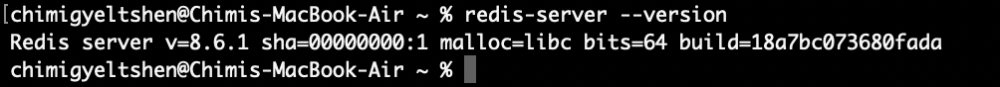
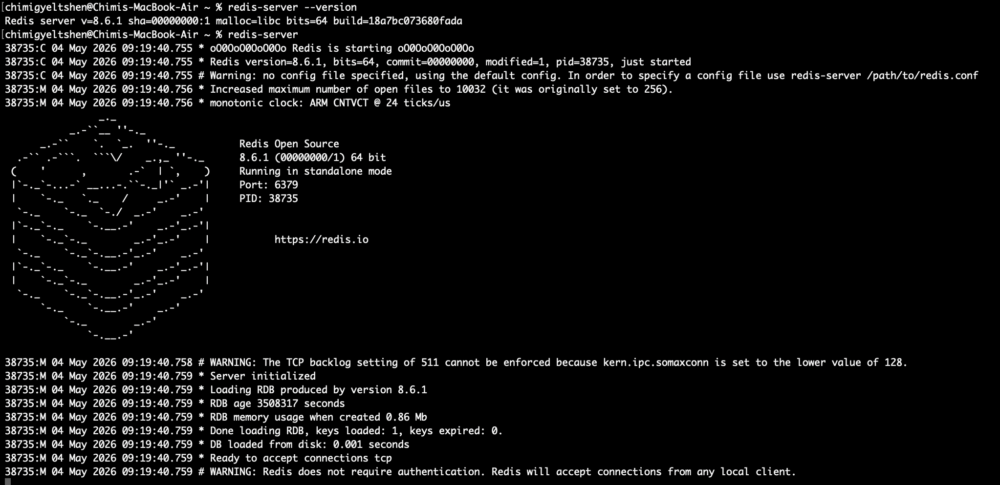
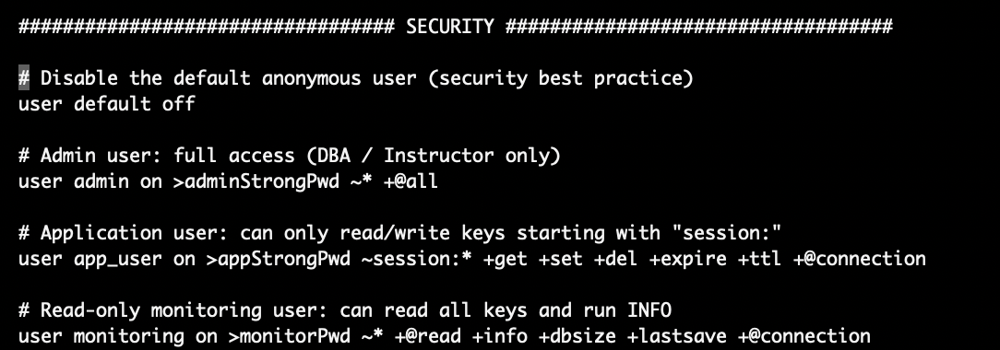
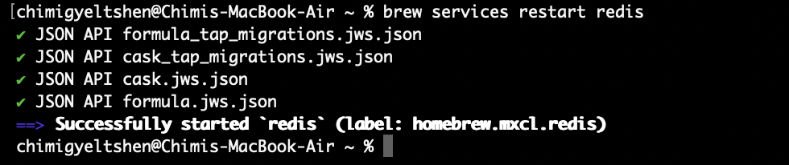

## **Step 0: Confirm Redis is installed and running**
* Check redis version:
    ```bash
    redis-server --version
    ```
    
* Start redis server:
    ```bash
    redis-server
    ```
    

* Opening a new terminal and check if redis is running:
    ```bash
    redis-cli 
    ping
    ```
    

## **Step 1: Enable ACL and Create Users**

**What is Access Control List (ACL):**
An Access Control List (ACL) is basically a simple list of rules attached to a file, folder, or network device that tells the system exactly who can do what.

**ACL in Redis:**
Redis ACL is like a security system for your database. When a program tries to connect, it must log in with a username and password. Once logged in, that program can only do what that user is allowed to do—like only reading certain data or running specific commands.

**Check users in Redis:**
```bash
ACL USERS
```

Redis also has a built-in **`default`** user for connections that don’t log in. If you change what the default user is allowed to do, you control what unauthenticated connections can access, which is a handy way to keep things safe without forcing everyone to log in.

In **`default configuration`**, very new connection is capable of calling every possible command and accessing every key.

## **Enable ACL and Create Users:**

To enable Access Control Lists (ACL) in Redis, we can choose between managing users via 
1. Command line
2. Configuration file  (redis.conf) 

#### **Using Command Line:** Disabling the open default user and creating three distinct roles (Admin, Application, and Monitoring) with strictly defined password, key-pattern, and command-category restrictions.
1. Open the Redis config file:
    ```bash
    sudo nano /etc/redis/redis.conf
    ```
2. Add the following ACL user definitions:
    ```bash 
    # Disable the default anonymous user (security best practice)
    user default off

    # Admin user: full access (DBA / Instructor only)
    user admin on >adminStrongPwd ~* +@all

    # Application user: can only read/write keys starting with "session:"
    user app_user on >appStrongPwd ~session:* +get +set +del +expire +ttl +@connection

    # Read-only monitoring user: can read all keys and run INFO
    user monitoring on >monitorPwd ~* +@read +info +dbsize +lastsave +@connection
    ```
    
3. Save and exit the file.
4. Restart the Redis server to apply changes:
    ```bash
    sudo systemctl restart redis
    ``` 
    
